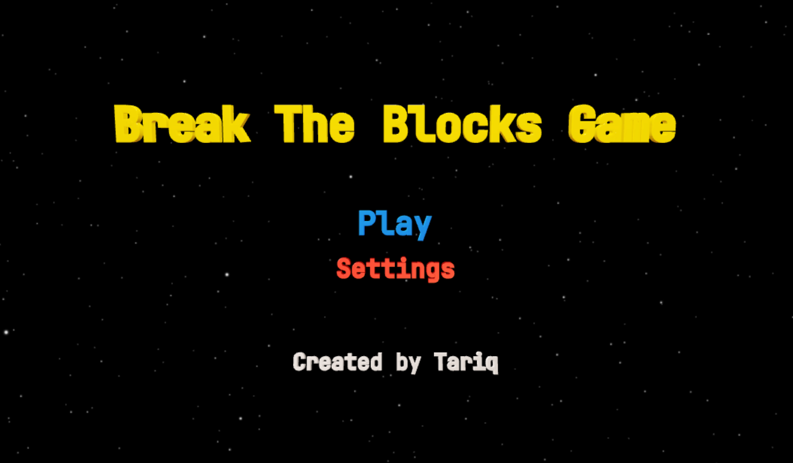

# Break The Blocks Game

> built using Three.js & Cannon.js



<!-- adding space -->

## Contents

-   [Introduction](#introduction)
-   [Project Idea](#project-idea)
-   [Project Features](#project-features)
-   [ThreeX](#threex)
-   [game sounds](#game-sounds)
-   [animate function](#animate-function)
-   [Try it!](#try-it)
-   [ThreeJS](#threejs)
-   [CannonJS](#cannonjs)

---

<!-- adding space -->

## Introduction

In this Project I built the well-known game, Break The Blocks Game, built it using ThreeJS & CannonJS, with ZERO knowledge in ThreeJS & CannonJS, but still managed to learn these libraries and build the game.

It was really fun and challenging experience, I used really Interesting Technologies, Which are WebGL(Based on OpenGL) with the Help of ThreeJS library to abstract some of the work of creating 3D Objects and CannonJS to add Physics to the game.

you might not know anything about ThreeJS or CannonJS but this brief description hopefully gives you some idea about them, ThreeJS is popular library that is used to create and display animated 3D computer graphics in web browser using WebGL, the role of ThreeJS here is that, ThreeJS is doing you a favor, "the developer" by abstracting a lot of work and encapsulating many instructions in just one call to a method.

CannonJS, Which it's popular Physics library that can handle collisions and the movements of the objects inside the 3D World.

---

## Project Idea

Break The Block Game is well-known game that exists from 1970s, it's mechanism for playing is known, the player will try to deflect the bouncing ball so he/she break the blocks, once he/she break all the blocks, he/she will win, but if the ball bypass the bar then he/she will lose.

---

## Project Features

you will have two main components, first one is "the main menu", second one is "the playground", let us start with the main menu, in the main menu you will have the "title" of the game, "play" button and name of game creator going up and down.

you will be able to move the camera to any direction, in addition you can zoom in/out with the scroll wheel, in case if you zoomed out/in a bit much then the renderer will not render the menu 3D objects and you will not be able to click them, to fix that zoom in/out!, also you can enter full screen mode by double clicking anywhere on the screen.

the reason behind not seeing tha menu in case of over zooming out/in is
that it has something to do with the Camera frustum.

if you look at the code below you will see that we are giving 0.1 as value for the Camera frustum near plane and 1000 as value for Camera frustum far plane.

```
// PerspectiveCamera( fov : Number, aspect : Number, near : Number, far : Number )
const camera = new THREE.PerspectiveCamera(45, clientWidth / clientHeight, 0.1, 1000);
```

**here is a visual representation for this concept**


**the renderer will not render any 3D objects outside the view frustum, 3D objects should be after near plane and before far plane, in aforementioned code
anything before 0.1 or after 1000 will not be visible, 0.1 and 1000 represents the distance from the original(0,0,0)(camera in the above picture or original in cartesian 3 dimensions plane) till the plane.**

**NOTE:** _ThreeJS support only vertical fov(fovY)_

**here is a visual representation for vertical fov or fovY**


in the playground you will have 52 colored blocks, that you have to destroy to win, you will have your purple bar that you can control using either the mouse or the keyboard keys/arrows, A & D keys or left & right arrows. (there a little hack here, you can exploit it to increase the speed of the bar, by pressing down together A and Left arrow or D and right arrow, the speed of the bar will double).

---

## ThreeX

Interaction is an essential part, without interacting with the 3D objects,
how would you play the game? here ThreeX comes to save us, ThreeX is a games extensions for ThreeJS, it includes many extensions that can help you, if you using ThreeJS to build games.

I chose Two extensions which are "ThreeX.domevents" and "ThreeX.keyboardState", from a long list of extensions, I will explain what are events and why we use them first and then I will go back to explain these two extensions.

when you want to add interactivity to a page to make it responsive you will certainly add events to these HTML elements, to know when this certain button got clicked or that 3D object in our case got clicked, using a method called addEventListener() of "document" object we can do that, but what if you want to attach events to ThreeJS 3D objects through Javascript? is it possible? apparently yes it's possible, using ThreeX.domevents and ThreeX.keyboardState extensions, will allow us interact with ThreeJS 3D objects in event-driven way,(by the way not all events are supported, the list of supported events for each extension is below).

you might wonder and ask yourself, what is then the difference between ThreeX.domevents and ThreeX.keyboardState?
ThreeX.domevents extension is used to add the following events to the 3D objects:

-   click
-   dblclick
-   mouseMove
-   mouseDown
-   mouseUp
-   touchmove
-   touchstart
-   touchend
-   contextmenu

assigning of the event will be like this:

```
domEvents.addEventListener(ThreeJS_Object, the_event, (the_event_object) => {
    the code...
});
```

you will notice that there is three parameters, first one "ThreeJS_Object" it's ThreeJS object that will be assigned "the_event", second parameter, "the_event" the type of the event you want to attach to this "ThreeJS_Object", third parameter is a function that gets an event object passed to it when it gets executed when the "the_event" happen, "the_event_object" will contain crucial information about the event that did happen.

so you will see that ThreeX.domevents doesn't actually consider keyboard events, so we need a solution to deal with keyboard pressed keys, fortunately there is another extension called "ThreeX.keyboardState" that can handle keyboard pressed keys elegantly with Keyboard.pressed('key') method that return true or false if the key is pressed or not, here is the list of the events it support:

-   Keydown
-   Keyup

```
Keyboard.pressed('a') // will return either true or false
```

---

## game sounds


adding sounds to the game is an important thing to do, mixing the visual side with the auditory side is important, making the experience of the game more fun and exciting, so I added sound to the following:

-   the main menu
-   the playground
-   when clicking Play button
-   the ball hitting the blocks
-   in case of winning
-   in case of losing

---

## animate function

this is the most important function in this whole process, animate() function gets registered to run every frame, it gets registered via requestAnimationFrame() function, for example when you register this method by passing it to requestAnimationFrame() if you have a screen that is 60FPS then this function gets executed 60 times per second, in other words your screen get rendered 60 times per second.

---

## Try it!

---

## ThreeJS

**main target:** Three.js is a Javascript library that is used to create and display animated 3D objects in a web browser using WebGL.<br />
**contribution:** creating and animating 3D Objects.<br />
**citation:** https://threejs.org<br />
**license:** Three.js is licensed under MIT license, and it grants any person who obtains a copy of the software and associated files the right to use, copy, modify, merge, distribute, publish, sublicense and sell copies of the software.<br />
**alternatives:** BabylonJS<br />

---

## CannonJS

**main target:** A lightweight and simple 3D physics engine for the web.<br />
**contribution:** adding physics to the 3D World.<br />
**citation:** https://github.com/pmndrs/cannon-es<br />
**license:** Cannon.js is licensed under MIT license, and it grants any person who obtains a copy of the software and associated files the right to use, copy, modify, merge, distribute, publish, sublicense and sell copies of the software.<br />
**alternatives:** physijs<br />
